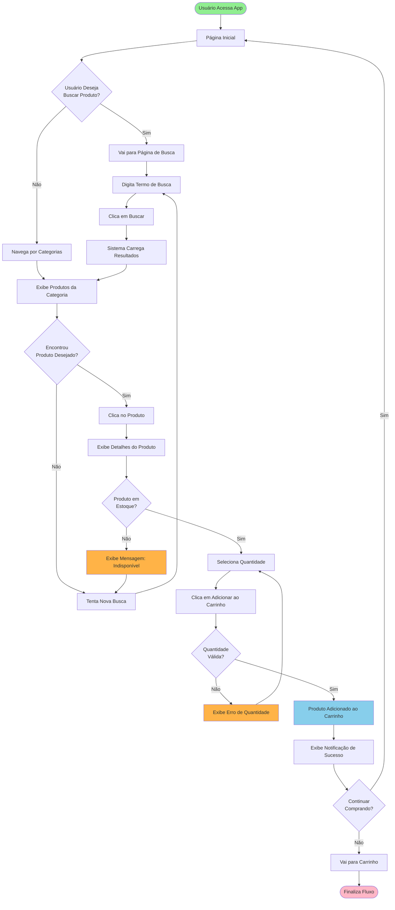
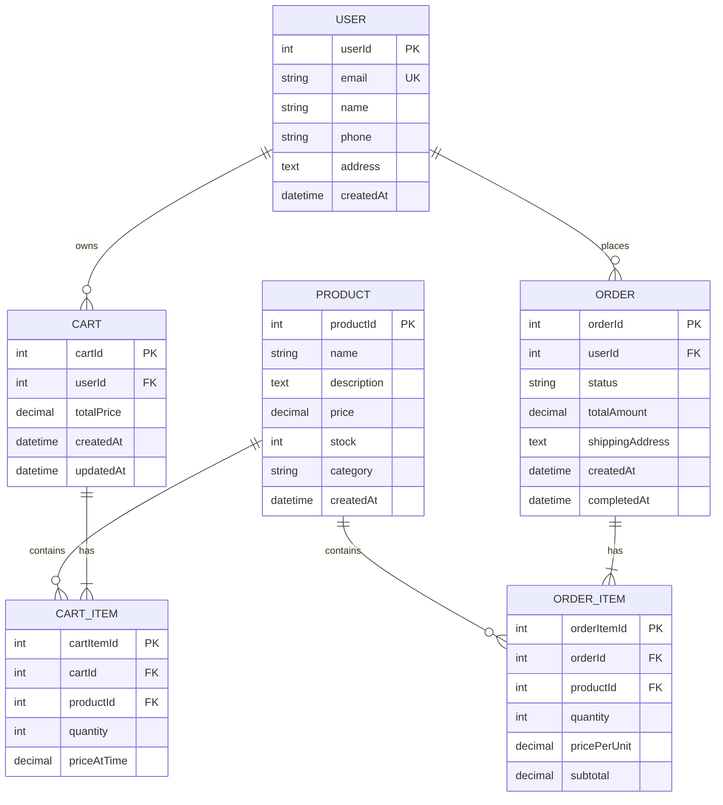

# Diagramas - Sctech Marketplace

## 1. Fluxo de Busca e Adição ao Carrinho

Diagrama que mostra o percurso completo do usuário desde o acesso à aplicação até adicionar um produto ao carrinho.

### Fluxograma do Usuário - Busca e Carrinho



### Explicação do Fluxo

#### **Fase 1: Descoberta de Produtos**
1. Usuário acessa a aplicação na página inicial
2. Escolhe entre:
   - **Buscar**: Ir para página de busca e digitar termo
   - **Navegar**: Explorar produtos por categorias

#### **Fase 2: Busca e Resultados**
3. Se buscou, o sistema carrega resultados baseado na query
4. Se navegou, exibe produtos da categoria selecionada
5. Sistema valida se encontrou correspondências

#### **Fase 3: Visualização do Produto**
6. Usuário clica no produto desejado
7. Sistema exibe página de detalhes com:
   - Descrição completa
   - Imagens
   - Preço
   - Disponibilidade em estoque

#### **Fase 4: Validações**
8. Sistema verifica se o produto está em estoque
9. Se indisponível: Exibe mensagem e retorna à busca
10. Se disponível: Permite seleção de quantidade

#### **Fase 5: Adição ao Carrinho**
11. Usuário seleciona a quantidade desejada
12. Clica em "Adicionar ao Carrinho"
13. Sistema valida quantidade (mínimo, máximo, estoque)
14. Se válida: Adiciona e exibe confirmação
15. Se inválida: Exibe erro e retorna à seleção

#### **Fase 6: Próximo Passo**
16. Usuário decide se continua comprando ou vai ao carrinho
17. Fluxo encerra na visualização do carrinho

### Pontos de Validação

| Validação | Tipo | Ação em Falha |
|-----------|------|---------------|
| Estoque disponível | Sistema | Exibe indisponível |
| Quantidade válida | Sistema | Mostra erro |
| Termo de busca | Cliente | Campo obrigatório |
| Seleção de quantidade | Cliente | Deve ser número positivo |

### Estados da Aplicação

```
┌─────────────────┐
│ HOME PAGE       │ ◄──────────────────────┐
└────────┬────────┘                        │
         │                                 │
    ┌────┴─────────────────────┐          │
    │                          │          │
    ▼                          ▼          │
┌───────────┐          ┌──────────────┐  │
│ SEARCH    │          │ BROWSE       │  │
└─────┬─────┘          └──────┬───────┘  │
      │                       │          │
      └───────────┬───────────┘          │
                  │                      │
                  ▼                      │
         ┌─────────────────┐             │
         │ PRODUCT DETAILS │             │
         └────────┬────────┘             │
                  │                      │
           ┌──────┴──────┐               │
           │             │               │
          (Em Estoque)  (Sem Estoque)    │
           │             │               │
           ▼             └───────────────┘
    ┌──────────────┐
    │ SELECT QUANTITY │
    └─────┬────────┘
          │
          ▼
    ┌──────────────┐
    │ CART         │
    └──────┬───────┘
           │
      ┌────┴────────────┐
      │                 │
   (Continue)      (Checkout)
      │                 │
      └─────────────────┘
```

---

## 2. Diagrama de Entidades e Relacionamentos (ER)

Diagrama que apresenta a estrutura do banco de dados com todas as entidades e seus relacionamentos.

### Diagrama ER do Marketplace



### Explicação das Entidades

#### USER (Usuário)
- Armazena dados dos clientes do marketplace
- **PK**: userId (chave primária)
- **UK**: email (chave única)
- Atributos: nome, telefone, endereço, data de criação

#### PRODUCT (Produto)
- Catálogo de produtos disponíveis
- Controla estoque e preço
- Categorizado e com descrição detalhada

#### CART (Carrinho)
- Armazena o carrinho temporário do usuário
- Relacionado com um **USER**
- Pode conter múltiplos **CART_ITEM**
- Mantém preço total atualizado

#### CART_ITEM (Item do Carrinho)
- Liga **PRODUCT** ao **CART**
- Armazena quantidade e preço no momento da adição
- Permite rastreamento de histórico de preços

#### ORDER (Pedido)
- Representa um pedido realizado pelo usuário
- Mantém histórico completo de compras
- Status pode ser: pendente, processando, enviado, entregue, cancelado
- Armazena endereço de entrega específico

#### ORDER_ITEM (Item do Pedido)
- Liga **PRODUCT** ao **ORDER**
- Mantém registro histórico do preço praticado na época da compra
- Calcula subtotal por item

### Relacionamentos

```
USER (1) ──owns──────────────o{ (N) CART
USER (1) ──places────────────o{ (N) ORDER
PRODUCT (1) ──contains──────o{ (N) CART_ITEM
CART (1) ──has─────────────{ (N) CART_ITEM
PRODUCT (1) ──contains──────o{ (N) ORDER_ITEM
ORDER (1) ──has────────────{ (N) ORDER_ITEM
```

### Cardinalidade

- **1 USER** possui **1 CART** ativo
- **1 USER** pode fazer **N ORDERs**
- **1 CART** pode ter **N CART_ITEMs**
- **1 ORDER** pode ter **N ORDER_ITEMs**
- **1 PRODUCT** pode estar em múltiplos **CART_ITEMs** e **ORDER_ITEMs**

---

## Notas Técnicas

### Frontend (Angular)
- Página de busca com autocomplete
- Paginação de resultados
- Filtros por categoria, preço, avaliação
- Validação de quantidade com min/max
- Toast/Snackbar para notificações

### Backend (Node.js/Express/NestJS)
- Endpoint GET `/api/products/search?query=...`
- Endpoint GET `/api/products/:id`
- Endpoint POST `/api/cart/add`
- Validação de estoque antes de confirmar adição
- Transação para garantir consistência

### Banco de Dados (SQLite)
- Tabela `products` com coluna `stock`
- Tabela `cart_items` com `product_id`, `quantity`
- Índices em `name` e `category` para busca rápida

---

## Próximos Diagramas

- [ ] Fluxo de Checkout e Pagamento
- [ ] Fluxo de Autenticação (Login/Registro)
- [ ] Fluxo de Gerenciamento de Pedidos
- [ ] Arquitetura de Sistema
- [ ] Sequência de Requisições API
