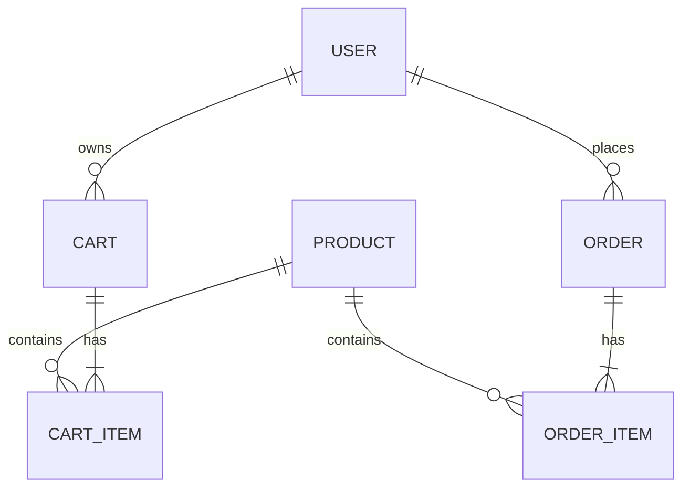

# Prompts Executados - Sessão de Desenvolvimento MarketFlow

**Data:** 2026-05-05  
**Projeto:** ScTech Marketplace (MarketFlow)  
**Objetivo:** Documentar todos os prompts/requisições executadas durante o setup inicial

---

## 1. Stack Tecnológica e ADR

**Prompt:**
```
Você é Product Owner, e precisa de um marketplace com angular e nodejs, 
com banco no sql lite, salve a stack tecnológica em docs/ADR.md
```

**Resultado:**
- ✅ Criado arquivo [docs/ADR.md](ADR.md)
- Documento ADR-001 com stack completa
- Justificativa de cada tecnologia
- Estrutura de pastas recomendada
- Riscos e mitigações
- Próximos passos

**Arquivos Gerados:**
- `docs/ADR.md` (702 linhas)

---

## 2. Diagrama ER - Entidades e Relacionamentos

**Prompt:**
```
Gere um código mermaid para um diagrama ER Simples, para o fluxo do usuário 
acessando o produto, adicionando ao carrinho e gerando um produto.
```

**Resultado:**
- ✅ Criado diagrama Mermaid ER
- 6 entidades principais: USER, PRODUCT, CART, CART_ITEM, ORDER, ORDER_ITEM
- Atributos detalhados com tipos
- Relacionamentos 1:N mapeados
- Salvo em [docs/ER-Diagram.md](ER-Diagram.md)

**Diagrama Incluído:**


---

## 3. Diagrama de Fluxo - Busca e Carrinho

**Prompt:**
```
Gere um diagrama de fluxo do usuário buscando um produto e adicionando 
ao carrinho, salve o código mermaid em docs/DIAGRAMAS.md
```

**Resultado:**
- ✅ Flowchart Mermaid com 6 fases:
  1. Descoberta de Produtos
  2. Busca e Resultados
  3. Visualização do Produto
  4. Validações (estoque)
  5. Adição ao Carrinho
  6. Próximo Passo
- Validações de erro com loops
- Notificações de sucesso
- Estados da aplicação diagramados

**Arquivo Criado:** `docs/DIAGRAMAS.md`

---

## 4. Consolidação de Diagramas

**Prompt:**
```
Junte o @file:ER-Diagram.md ao @file:DIAGRAMAS.md
```

**Resultado:**
- ✅ Arquivo [DIAGRAMAS.md](DIAGRAMAS.md) consolidado
- Seção 1: Fluxo de Busca e Adição ao Carrinho
- Seção 2: Diagrama ER (consolidado)
- Notas técnicas para Frontend, Backend e BD
- Próximos diagramas listados

---

## 5. Página Inicial - HTML

**Prompt:**
```
Crie uma página inicial para o site, com uma barra de busca no topo, 
ao lado do nome do projeto "MarketFlow" e uma lista de cards de produtos, 
com foto, nome e preço, crie o arquivo index.html na raiz do projeto.
```

**Resultado:**
- ✅ Criado [index.html](../index.html) na raiz
- Header sticky com logo e barra de busca
- Grid responsivo de 12 produtos
- Cards com: emoji, nome, categoria, preço, rating
- Funcionalidades:
  - Busca em tempo real
  - Carrinho com contador
  - Adição de produtos
  - Notificações Toast
  - Responsivo (desktop, tablet, mobile)

**Características:**
- Gradiente roxo moderno (#667eea → #764ba2)
- Dados de exemplo 12 produtos
- JavaScript com lógica de carrinho
- Animations suaves

---

## 6. Arquivo CSS - Estilos Externos

**Prompt:**
```
crie um arquivo .css para os estilos
```

**Resultado:**
- ✅ Criado [styles.css](../styles.css)
- Refatoração do CSS inline do HTML
- Organizado por seções comentadas
- Media queries responsivas (tablet 768px, mobile 480px)
- Variáveis de cor consistentes
- Animations (slideIn, slideOut)

**Estrutura CSS:**
```
- Reset e base styles
- Header e logo
- Search bar
- Cart icon
- Main content
- Products grid
- Product cards
- Footer
- Animations
- Media queries (tablet e mobile)
```

**Total:** 320 linhas bem organizadas

---

## 7. Commit Semântico e Push

**Prompt:**
```
Crie um commit semântico e faça o push para o repositório
```

**Resultado:**
- ✅ Commit `1fb668c` criado
- Tipo: `feat` (feature)
- Escopo: "initial marketplace setup with documentation and UI"

**Conteúdo do Commit:**
```
feat: initial marketplace setup with documentation and UI

- Add Architecture Decision Record (ADR-001) with stack technology definition
- Add Entity Relationship Diagram with 6 main entities
- Add comprehensive flow diagrams for product search and cart operations
- Create responsive HTML landing page with product grid and search functionality
- Extract CSS to separate stylesheet with modern gradient design and animations
- Implement shopping cart functionality with notifications and badge counter

Arquivos inclusos:
* docs/ADR.md - Technology stack justification and roadmap
* docs/DIAGRAMAS.md - Consolidated diagrams (ER and user flows)
* index.html - Interactive marketplace homepage
* styles.css - Modular responsive styles
```

**Push Result:**
- ✅ Enviado para `https://github.com/scha-chan/sctech-marketplace.git`
- Branch: `main` → `origin/main`
- 4 arquivos, 1092 inserções

---

## 8. Arquivo de Instruções e Arquitetura

**Prompt:**
```
ao criar o projeto siga a arquitetura do @file:ADR.md
```

**Resultado:**
- ✅ Criado [.instructions.md](../.instructions.md) na raiz
- Arquivo de customização VS Code Agent
- Enforça padrões arquiteturais em todo o projeto
- Aplicado a: `**/*.ts,**/*.tsx,**/*.js,src/**,backend/**,frontend/**,docs/**`

**Conteúdo do .instructions.md (701 linhas):**

1. **Technology Stack Overview**
   - Frontend, Backend, Database, DevOps

2. **Project Structure**
   - Estrutura de pastas detalhada
   - Organização de módulos

3. **Coding Standards**
   - TypeScript rules (strict mode, tipos explícitos)
   - Naming conventions (PascalCase, camelCase)
   - Code organization por tipo de arquivo

4. **Database Schema (SQLite)**
   - Naming conventions (snake_case, plurals)
   - Exemplo TypeORM com @Entity

5. **API Standards (REST)**
   - Endpoint naming pattern
   - Response format padrão
   - Error handling

6. **Frontend Guidelines (Angular)**
   - Module organization
   - Component pattern com RxJS
   - Service pattern
   - Exemplo completo ProductComponent

7. **Backend Guidelines (NestJS)**
   - Module structure
   - DTO validation
   - Service layer com TypeORM
   - Controller pattern
   - Exemplo completo CRUD

8. **Testing Requirements**
   - Jest backend tests
   - Jasmine/Karma frontend tests
   - Exemplos práticos

9. **Git & Commit Standards**
   - Branch naming (main, develop, feature/XXX)
   - Semantic commit format
   - Tipos e exemplos

10. **Environment Configuration**
    - Backend .env example
    - Frontend environment.ts

11. **Common Pitfalls & Solutions**
    - Circular dependencies
    - Memory leaks
    - N+1 queries
    - etc.

12. **Next Steps & Roadmap**
    - 12 passos até produção

**Commit:**
- Hash: `051502c`
- Tipo: `docs`
- Mensagem: "docs: add architecture guidelines and development standards"
- Pushed para main ✅

---

## Resumo de Arquivos Criados

| Arquivo | Tipo | Linhas | Status |
|---------|------|--------|--------|
| docs/ADR.md | Markdown | 702 | ✅ Committed |
| docs/ER-Diagram.md | Markdown + Mermaid | 280 | ✅ Committed |
| docs/DIAGRAMAS.md | Markdown + Mermaid | 380 | ✅ Committed |
| index.html | HTML + JS | 550 | ✅ Committed |
| styles.css | CSS | 320 | ✅ Committed |
| .instructions.md | Markdown (Agent) | 701 | ✅ Committed |

**Total:** 6 arquivos, 2,933 linhas de código + documentação

---

## Commits Realizados

```
1fb668c (HEAD -> main, origin/main) 
  feat: initial marketplace setup with documentation and UI
  
051502c 
  docs: add architecture guidelines and development standards
```

---

## Stack Adotada (Confirmada)

### Frontend
- **Framework:** Angular v17+
- **Linguagem:** TypeScript
- **Ferramentas:** npm, Angular CLI, SCSS/CSS3
- **Estado:** RxJS + Angular Services

### Backend
- **Runtime:** Node.js v18+
- **Framework:** NestJS (recomendado) ou Express.js
- **Linguagem:** TypeScript
- **ORM:** TypeORM ou Sequelize

### Database
- **SGBD:** SQLite 3
- **ORM:** TypeORM / Sequelize
- **Migrations:** ORM-managed

### DevOps
- **Versionamento:** Git + GitHub
- **Testes:** Jest + Jasmine/Karma
- **Linting:** ESLint + Prettier
- **CI/CD:** GitHub Actions (future)

---

## Próximos Passos (Roadmap)

1. ✅ Configuração inicial do repositório Git
2. ✅ Documentação de arquitetura e stack
3. ✅ Diagramas (ER e fluxos de usuário)
4. ✅ Página inicial prototype (HTML/CSS/JS)
5. ⏳ Setup do projeto Node.js + NestJS
6. ⏳ Setup do projeto Angular
7. ⏳ Definição de Entidades e Schema do Banco de Dados
8. ⏳ Implementação de autenticação e autorização
9. ⏳ Criação de CI/CD pipeline
10. ⏳ Testes unitários e integração
11. ⏳ Docker containerização
12. ⏳ Deployment em ambiente de staging/produção

---

## Links Úteis

- **Repositório:** https://github.com/scha-chan/sctech-marketplace.git
- **Branch Principal:** main
- **Documentação de Arquitetura:** [docs/ADR.md](ADR.md)
- **Diagramas:** [docs/DIAGRAMAS.md](DIAGRAMAS.md)
- **Guidelines de Desenvolvimento:** [.instructions.md](../.instructions.md)

---

**Documento Criado:** 2026-05-05  
**Sessão:** Setup Inicial e Prototipagem  
**Status:** COMPLETO ✅

Todos os artefatos foram criados, versionados e disponibilizados no repositório GitHub.
